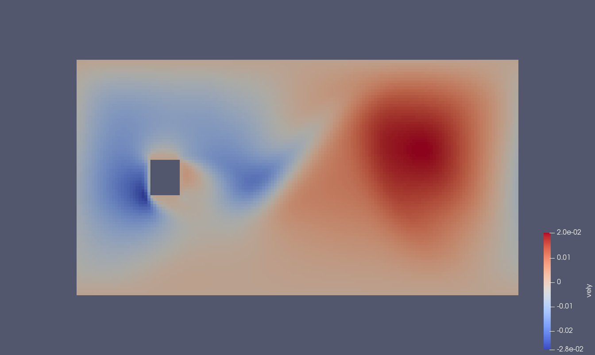

# 2D SRT Karman vortex street

Example of fluid velocity and pressure/density. Flow from left to right, driven by a body force.

## Periodic boundary conditions in x and y


## Periodic in x direction no-slip in the y direction


## Periodic in x direction free-slip in the y direction





## Input file
```
# ----------------------------
# ----------------------------
<iterations>
    max   300000  # stop simulation after 
    write 1000    # write interval in steps
<end>
# ----------------------------
<out>
    directoryNum 03
<end>
# ----------------------------
# ----------------------------
<diff>
    tau 0.515  
<end>
```

#### System spesirications
$$
\begin{array}{lll}
 \tau & 0.515 & \mbox{relaxation time} \\
  \nu & 0.005,& \mbox{kinetic viscosity} \\
S  _{\mathrm{obstical}} & 10\times 12  & \mbox{size of obstical} \\ S_\mathrm{system} & 150\times 82 & \mbox{system size} \\
\mathrm{Re} & \sim 120 & VL_\mathrm{obstical}/\nu \\
\vec{F} & (0.5\cdot 10^{-6}, 0.0) & \mathrm{body force} 
\end{array}
$$

## Appendix
### Python geometry input
```python
# Simple geometry for testing
import vtklbNew
import numpy as np

geo = np.zeros((150, 82), dtype=int)

# rank 0, 
geo[:50, :] = 1
# Rank 1
geo[50:100,:] = 2
# Rank 2
geo[100:150,:] = 3
# Solid
geo[25:35,35:47] = 0

vtk = vtklbNew.vtklb(geo,"D2Q9", "tmp", "/home/ejette/Programs/GitHub/BADChIMP-cpp/input/mpi/", periodic="xy") 

boundary_marker = np.zeros(geo.shape,dtype=int)
#boundary_marker[0, :] = 2  # Inlet
#boundary_marker[-1,:] = 3  # Outlet
#boundary_marker[:, 0] = 1  # bottom
#boundary_marker[:, -1] = 4 # top

vtk.append_data_set("boundary", boundary_marker)
```