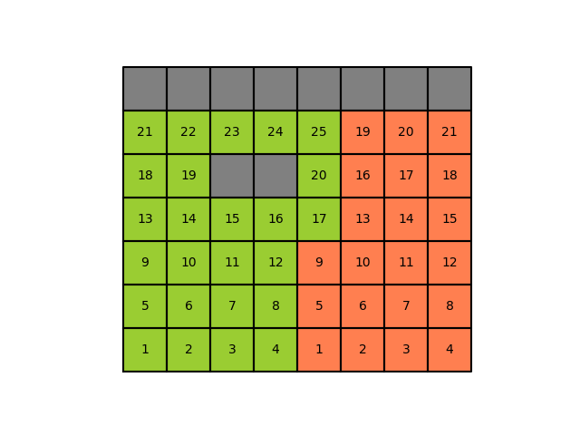
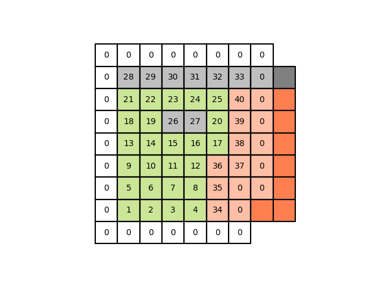

# VTK like Geometry file format


## Overview of the file format 
Same as vtk:
```
# BADChIMP vtklb Version 0.1     <header>
one line descriptioin            <title> 
ASCII | BINARY                   <data type>
DATASET type                     <geometry/topology>
...
POINT_DATA n                     <dataset attributes>
...
```

### Geometry/Topology
#### UNSTRUCTURED LB GRID
```
DATASET UNSTRUCTURED_LB_GRID
NUM_DIMENSIONS nd               <nd: int number of spatial dimension>
GLOBAL_DIMENSIONS n0 n1 ...     <Size of the bounding box of the system>
USE_ZERO_GHOST_NODE             <use node 0 as the default ghost node>
POINTS n dataType               <n: number of points>
p1_xp1_y...                     <point/node spatial position>
p2_xp2_y...
...
LATTICE nq dataType             <nq: number of basis vectors>
c0_xc0_y...                     <basis vecotor elements>
c1_xc1_y...
...
NEIGHBORS dataType              <list of neighbor nodes for each node>
i1_0i1_1...i1_(nq-1)            <node number of neighbor nodes>
i2_0i2_1...i2_(nq-1)
...
in_0in_1...in_(nq-1)
PARALLEL_COMPUTING rank         <rank: rank of the current processor>
PROCESSOR n rank                <n: number of point, rank: neighbor processor>
i0j0                            <i: node this rank, j: node neighbor rank>
i1j1
...
i(n-1)j(n-1)
```
#### Comments to entries

- ```NUM_DIMENSIONS```: (Optional, Default: nd=3)  Specify number of spatial dimensions. In vtk it seems that all vectors and positions are given with three components. 

- ```GLOBAL_DIMENSIONS```: Gives the size of the system in each Cartesian direction include the ghost node rim. This entry should be the same for all processors. This information is needed by the vtk-output routine.

- ```USE_ZERO_GHOST_NODE```: (Optional) Treat node 0 as a placeholder for a node that is not in use (i.e solid nodes). This means that we begin numbering points from 1, _not_ 0. If the key word is written then this feature is enabled.

- ```POINT```: Same as for the vtk-format. NB if ```USE_ZERO_GHOST_NODE``` is enabled then the the first entry has node number 1, the next has 2 and so on. If ```USE_ZERO_GHOST_NODE``` is disabled  the first entry has node number 0.

- ```LATTICE```: Description of the set of basis vector. We can check these with the ones used in the BADChIMP code and map one set to the other if that is needed.

- ```NEIGHHBORS```:  For each node there is a list of ```nq``` nodes. The node number corresponds to the position in the list under the _points_ keyword and the position in the list of neighbors corresponds to the basic vector in the list under the _lattice_ keyword.

- ```PARALLEL_COMPUTING```: Begins the block describing the processor-processor communication. _rank_ is the rank of the current processor.

- ```PROCESSOR```:  Information about neighboring processor. _n_ is the number of nodes at the current processor that is used to represent the nodes at a neighboring process. _rank_ is the rank of the neighboring node. The list under the key-word the first entry, _i_, is the node number in the geometry in the current processor that represent the node with number _j_ in the neighboring rank, the second entry on the line.

#### STRUCTURED LB GRID
```
DATASET STRUCTURED_LB_GRID
NUM_DIMENSIONS nd               <nd: int number of spatial dimension>
GLOBAL_DIMENSIONS n0 n1 ...     <Size of the bounding box of the system>
LOCAL_DIMENSIONS n0 n1 ...      <Size of the system on the given processor excluding the rim of ghost nodes>
LOCAL_RIM_WIDTH nw              <nw: int number of rim width>
LOCAL_TO_GLOBAL_POS po p1 ...   <Sets the global position relative to the local origo>
LATTICE nq dataType             <nq: number of basis vectors>
c0_xc0_y...                     <basis vecotor elements>
c1_xc1_y...
...
PERIODIC_NODES n rank           <n: number of point, rank: neighbor processor>
i0j0                            <i: 'ghost' node, j: bulk node> 
i1j1 
...
PARALLEL_COMPUTING rank         <rank: rank of the current processor>
PROCESSOR n rank                <n: number of point, rank: neighbor processor>
i0j0                            <i: node this rank, j: node neighbor rank>
i1j1
...
i(n-1)j(n-1)
```
### Dataset attributes

```
POINT_DATA n                                         <n: number of entries>
LATTICE dataName dataType nc
v1_0_0v1_0_1...v1_0_(nc-1)v1_1_0...v1_(nq-1)_(nc-1)  <value of each component for each direction>
v2_0_0v2_0_1...v2_0_(nc-1)v2_1_0...v2_(nq-1)_(nc-1)
...
```

    

**Standard vtk- attribute.**
- ```POINT_DATA n```
as in standard vtk-format. n is the same as ```DATASET``` -> ```POINT``` number of points

**New data attribute key-word**:
```
POINT_DATA_SUBSET n          <n: number of entries>
i0                           <list of node numbers>
i1
... 
``` 
- ```POINT_DATA_SUBSET n```
    - ```n``` number of nodes in the subset must be less than or equal the the number of points defined in ```DATASET``` -> ```POINT```
    
    The list of number gives the node numbers for the nodes part of the subset. Subsequent listed attributes will use the same ordering as in ```POINT_DATA_SUBSET```, so that the first attribute listed will be assigned to ```i0``` the second to ```ì1``` and so on.


**Lattice Boltzmann specific data attributes**

- ```LATTICE dataName dataType numComp```
     - ```dataName```: name of data block as string
     - ```dataType```: entries' data type
     - ```numComp```: number of entries per element
     
     The structure of the entries are on the form 
     ```vi_0_0vi_0_1...vi_0_(nc-1)vi_1_0...vi_(nq-1)_(nc-1)```
     where ```i``` stands for the node number, the first integer gives the lattice direction, and the second index gives the component. So if one wants to give a scalar for each lattice direction. Then nc = 1 and there are only on entry for each lattice direction. If one wants to set a vector for each direction then nc=3 and the first three values are the the vector component for lattice direction 0, the next three entries are for lattice direction 1 and so on.
     
      

Here we can also use the same formalism as the vtk-file format. That is use the key-words:

- ```SCALARS dataName dataType```

- ```VECTORS dataName dataType```

- ```TENSORS dataName dataType```

## Example 
 
Figure 1 shows an example geometry, where the green and orange areas shows the partitioning of the computational nodes between processor 1 and 2.

Each processor the fluid nodes are consecutively labeled starting from 1. Figure 2 shows labeling of the fluid nodes. Where the solid nodes (in gray) not given global labels.  
For standard fluid flow simulations we would like to allocate memory for the solid wall nodes, but we do not need to transfer wall values between processors. 

The above figure (Fig. 3) shows the local labeling for processor 1. The labeling of the fluid nodes follow that of figure 2 for the fluid nodes on processor 1 but note that the fluid node on the neighboring  processor is relabeled. These nodes need to be linked to the local labels on processor 2. The zero label is used as a default ghost node.